# AllFi — All-Asset Aggregation Platform

> A personal, self-hosted wealth control center curated for Web3 professionals.

[](LICENSE)
[](https://golang.org/)
[](https://goframe.org/)
[](https://vuejs.org/)
[](https://vite.dev/)
[](https://tailwindcss.com/)

[中文文档](./README.md)

---

## Why AllFi? (The Pain We Solve)

**"Hitting a new ATH in BTC-margin every day feels exciting yet painful?"**
When Bitcoin dumps, even if your altcoins are up against BTC, your total fiat net worth might still be bleeding. Break free from the pricing illusion!

As a Web3 professional or heavy participant, you likely face these daily headaches:

1. **Extreme Fragmentation**: Your wealth is scattered across Binance, OKX, dozens of on-chain wallets, and DeFi protocols, not to mention your real-world bank accounts and stocks. Just answering "how much am I actually worth right now?" is a chore.
2. **Pricing Confusion**: Did I make crypto or did I make fiat? Different platforms use different base currencies, making it incredibly hard to stay objective during bull-to-bear market swings.
3. **Security & Privacy Anxiety**: You want an all-in-one portfolio tracker, but you would **never** trust a centralized SaaS with your exchange API keys or associate all your public wallet addresses in one cloud database.
4. **The Excel Nightmare**: Maintaining a manual spreadsheet means constantly pulling prices and balances yourself. It's tedious and unsustainable.

## The AllFi Solution

AllFi is built to solve this. It's not a SaaS; it is a **100% open-source, locally self-hosted** all-asset aggregation console. Your data, API keys, and wallet addresses live exclusively on your own server or machine. 

Switch seamlessly between multiple base currencies (USDC / BTC / ETH / Fiat) with a single click to pierce through the market fog and see the true picture of your portfolio.

Supported asset sources:
- **CEX Exchanges**: Binance, OKX, Coinbase
- **On-chain Wallets**: Ethereum, BSC, Polygon (+ Arbitrum/Optimism/Base)
- **DeFi Protocols**: Lido, RocketPool, Aave, Compound, Uniswap V2/V3, Curve
- **NFT Collections**: Alchemy integration for browsing and valuation
- **Traditional Assets**: Bank deposits, cash, stocks, mutual funds

### 🌟 Flex Your Gains, Safely

With AllFi, you can activate **Privacy Mode (Ctrl+H)** with one click. It blurs out your absolute amounts (showing `$••••`) while perfectly preserving your asset distribution pie charts, PnL trends, and investment achievements. 
**Take a screenshot and share your dashboard with your community — flex your portfolio management skills without ever exposing your real net worth!**

---

## Key Features

| Category | Features |
|----------|----------|
| Asset Aggregation | CEX + on-chain + DeFi + NFT + traditional assets in one view |
| Multi-currency Pricing | USDC / BTC / ETH / CNY — switch freely |
| Transaction History | Unified CEX + on-chain records with incremental sync and cursor pagination |
| Analytics | Daily PnL, fee analytics, attribution analysis, benchmark comparison (vs BTC/ETH/S&P500) |
| Strategy Engine | Target allocation + rebalance suggestions |
| Reports | Auto-generated daily / weekly / monthly / annual reports |
| Achievements | 11 investment achievement badges |
| Notifications | Price alerts + WebPush browser notifications |
| Privacy Mode | One-click blur all amounts for screen sharing |
| Themes | 4 professional financial themes (3 dark + 1 light) |
| Languages | Simplified Chinese / Traditional Chinese / English |
| PWA | Add to home screen, works offline |

---

## Interface Preview

### Asset Dashboard (Nexus Pro Theme)

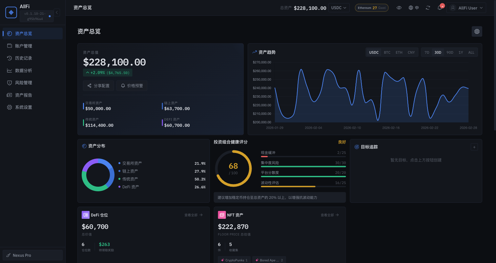

> Aggregate CEX + On-chain + DeFi + Traditional assets in one screen. Real-time total assets, today's PnL, trends, and distribution pie charts.

### Core Pages

<table>
  <tr valign="top">
    <td width="50%">
      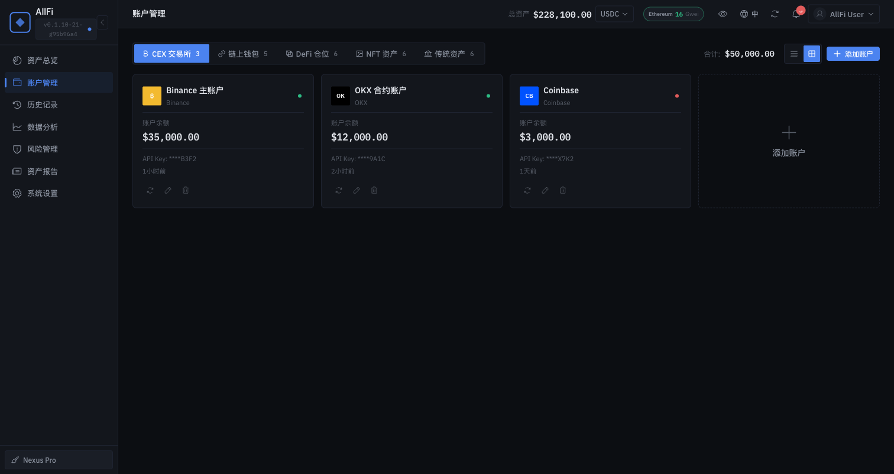
      <br><b>Accounts Management</b> — Tagged management for CEX / On-chain / DeFi / NFT / Traditional
    </td>
    <td width="50%">
      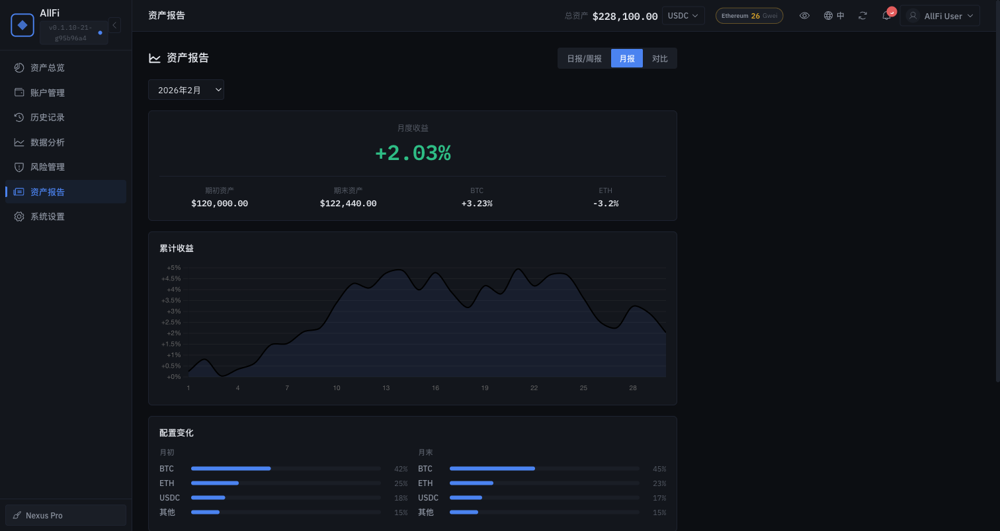
      <br><b>Asset Reports</b> — Auto-generated daily / weekly / monthly / annual reports
    </td>
  </tr>
  <tr valign="top">
    <td width="50%">
      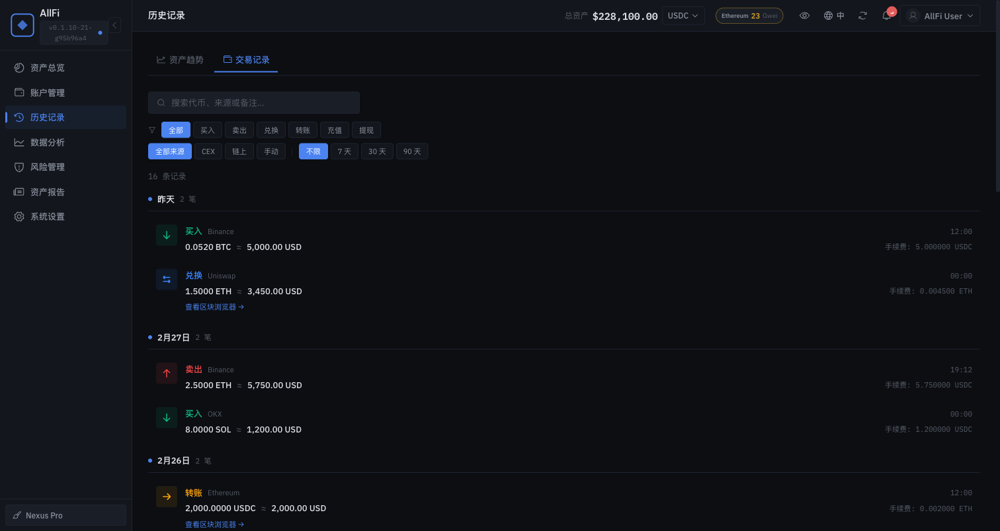
      <br><b>Transaction History</b> — Unified CEX + on-chain records with robust filtering
    </td>
    <td width="50%">
      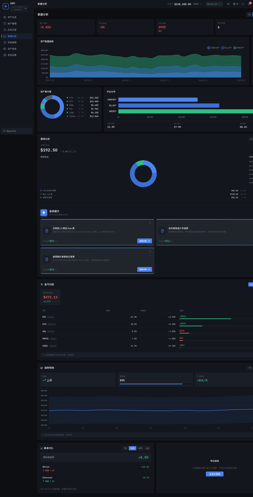
      <br><b>Analytics</b> — Daily PnL, fee analysis, attribution, and benchmark tracking
    </td>
  </tr>
</table>

### Dashboard Details

<table>
  <tr valign="top">
    <td width="33%"><br><b>Portfolio Health</b> — Cash buffers, concentration limits, platform diversity, volatility</td>
    <td width="33%">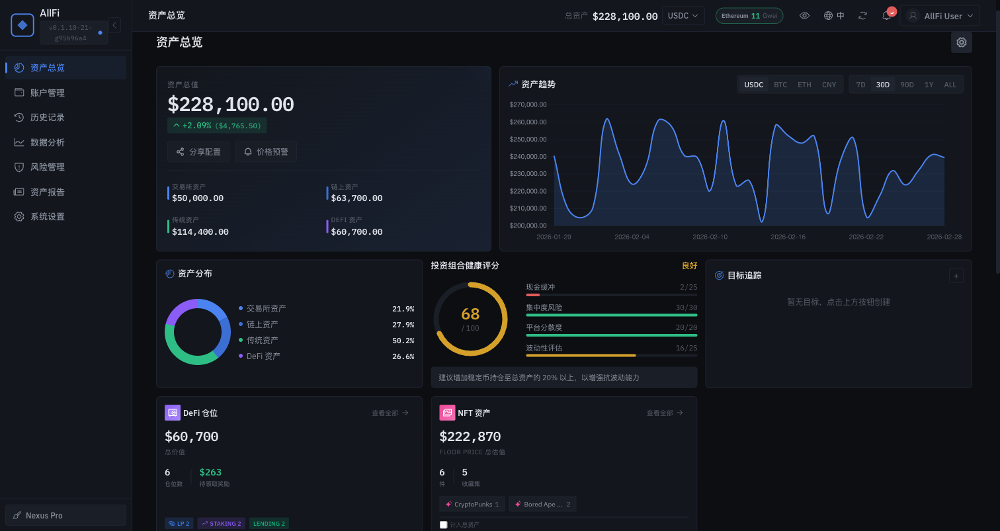<br><b>NFTs & Fee Tracking</b> — Collection valuations, gas fee spending, cost-saving insights</td>
    <td width="33%">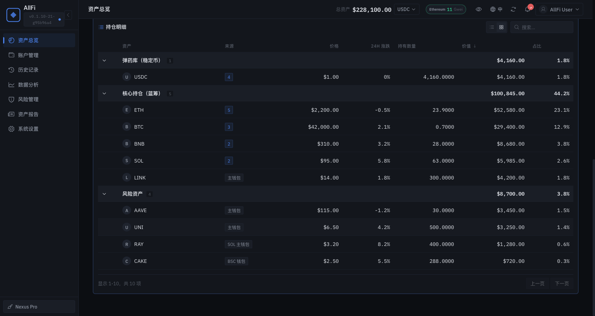<br><b>Strategy Engine</b> — Automated balancing policies and smart portfolio groupings</td>
  </tr>
</table>

### 4 Professional Themes

<table>
  <tr valign="top">
    <td width="25%"><br><b>Nexus Pro</b><br>Bloomberg style, professional blue</td>
    <td width="25%">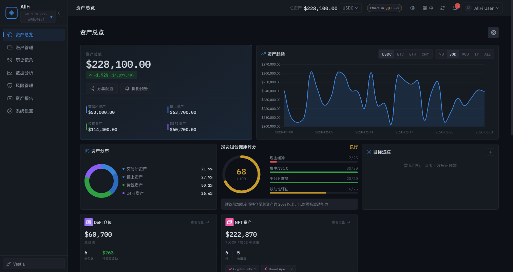<br><b>Vestia</b><br>GitHub dark style</td>
    <td width="25%">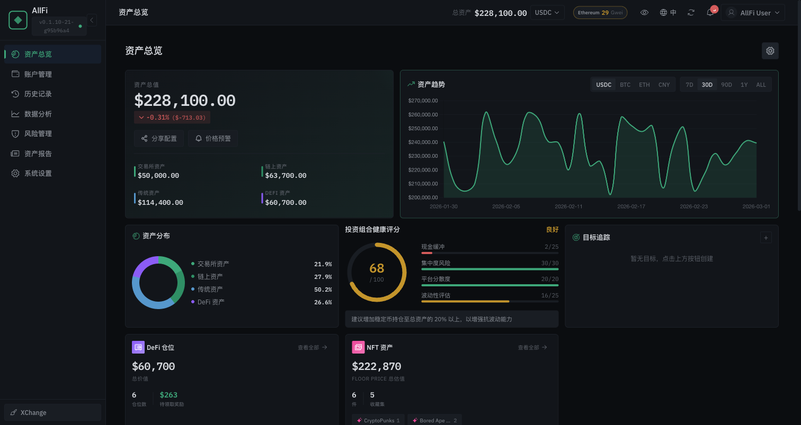<br><b>XChange</b><br>Exchange style, calm green</td>
    <td width="25%">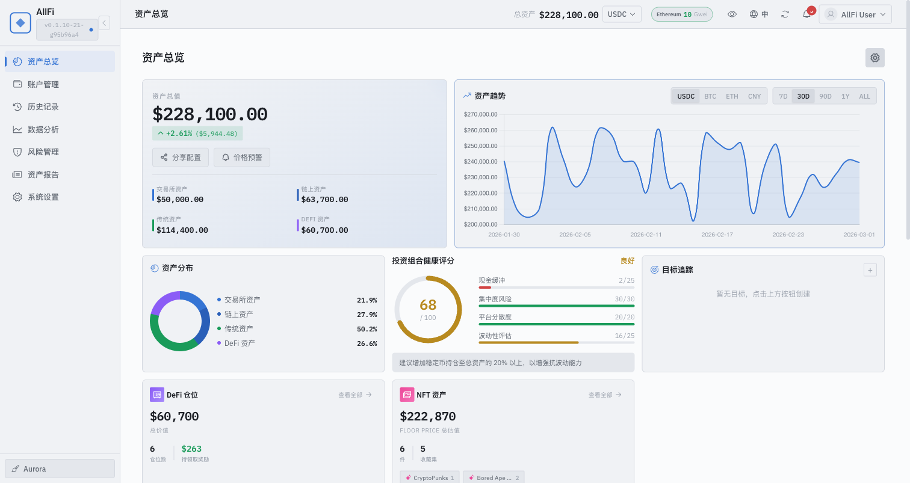<br><b>Aurora</b><br>Professional light theme</td>
  </tr>
</table>

### Feature Highlights

<table>
  <tr valign="top">
    <td width="50%">
      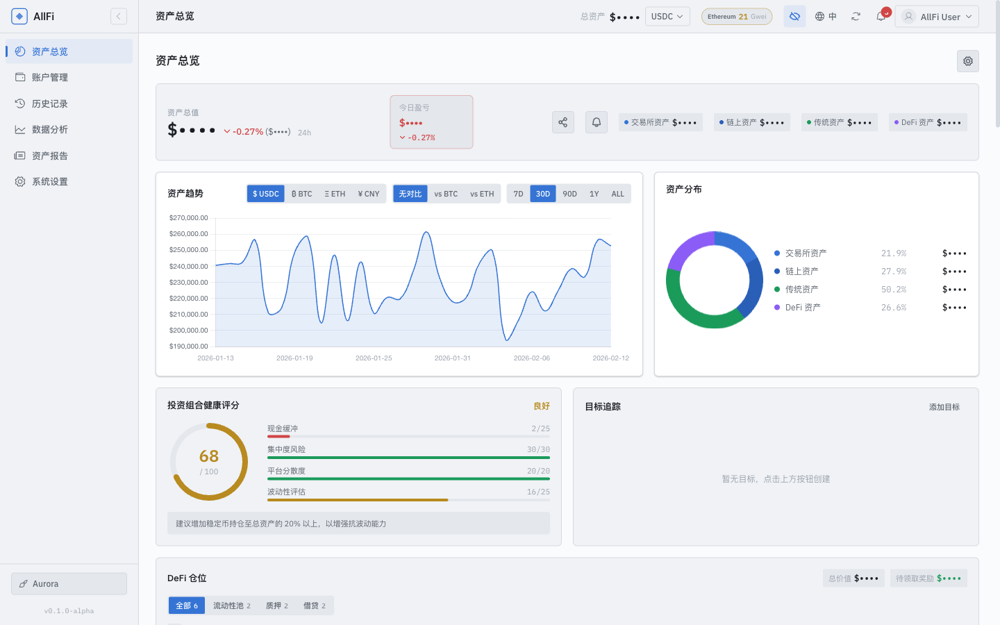
      <br><b>Privacy Mode</b> — Ctrl+H to blur amounts ($••••), safe for screen sharing
      <br><br>
      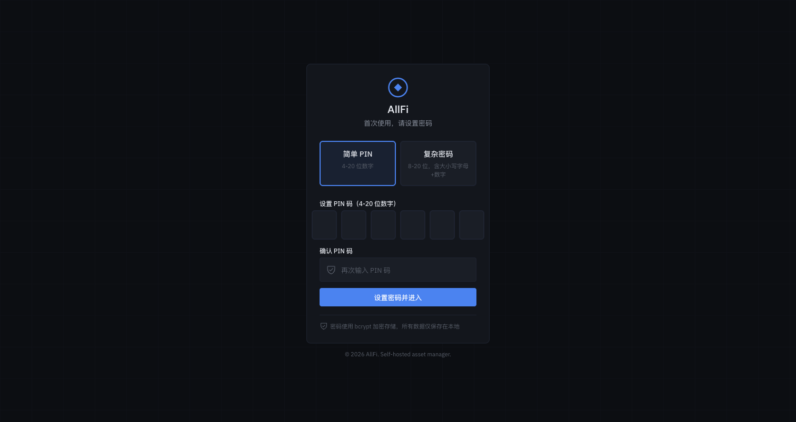
      <br><b>PIN Authentication</b> — Simple and secure PIN login with bcrypt integration
    </td>
    <td width="50%" align="center">
      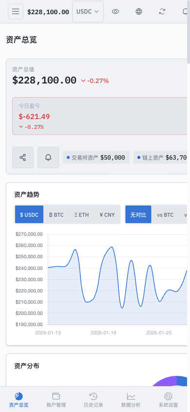
      <br><b>Mobile Adapted</b> — Responsive layout + bottom nav + pull-to-refresh
    </td>
  </tr>
</table>

---

## Quick Start

### Option 1: Docker Deployment (Recommended) 🐳

**Only requires Docker — no need to install Go / Node.js / pnpm locally.**

Prerequisites: Docker 20.10+, Docker Compose v2+

#### One-click Script Deployment (Recommended)

```bash
# Fetch the standalone binary auto-deployment script (No git clone needed!)
curl -sSL https://raw.githubusercontent.com/your-finance/allfi/master/deploy/docker-deploy.sh | bash
```

The script automatically: determines your OS architecture → downloads the pre-built binary package → generates `.env` + security keys → builds a lightweight Docker image without needing compiler toolchains → starts all services.

#### Manual Docker Deployment from Source

(If you have cloned the repo or want to build from source code)

```bash
git clone https://github.com/your-finance/allfi.git
cd allfi

# Generate .env (required for first run)
cp .env.example .env
# Edit .env — set ALLFI_MASTER_KEY (or auto-generate with the line below)
sed -i "s|CHANGE_ME_USE_openssl_rand_base64_32|$(openssl rand -base64 32)|" .env

# Build from source using Docker Compose (requires higher memory)
docker compose up -d --build
```

#### Deployment Version Comparison

| Version | Data Storage | Use Case |
|---------|-------------|----------|
| **Script / docker-compose.yml** | Docker named volumes | Simple setup, one click deploy |
| **From Source / Manual** | Docker or local volumes | Developers and modifications |

#### Default Port Mapping

| Service | Container Port | Host Port | URL |
|---------|---------------|-----------|-----|
| AllFi (Frontend + API) | 8080 | **3174** | http://localhost:3174 |
| AllFi (Direct API) | 8080 | **8080** | http://localhost:8080 |

> AllFi uses Go embed — frontend static files are embedded into the backend binary, serving both frontend pages and API from a single port.

Visit http://localhost:5173 to get started. First-time access requires setting a PIN code (4–8 digits).

> **Custom Ports**: Edit the `.env` file to change port mappings, then restart:
> ```bash
> # .env
> ALLFI_PORT=3000    # Change to port 3000
> ```
> ```bash
> docker compose -f docker-compose.local.yml up -d --build   # Restart to apply changes
> ```

```bash
# 1. Stop and archive on the source server
cd allfi-docker
docker compose down

# Assuming your volume is allfi-data, you can export the volume backing it
docker run --rm -v allfi-data:/data -v $(pwd):/backup alpine:3.21 tar czf /backup/allfi-data.tar.gz -C /data .

# 2. Transfer to the new server
scp allfi-data.tar.gz user@new-server:/path/

# 3. Extract and start on the new server
# Just run the curl command on the new server to deploy, 
# then restore the allfi-data volume and restart docker compose.
```

#### Common Docker Commands

```bash
cd allfi-docker
docker compose logs -f       # View logs
docker compose down          # Stop services
docker compose restart       # Restart services
docker compose up -d         # Start services
docker compose ps            # View status
```

#### Reverse Proxy Configuration (Recommended for Production)

To access AllFi with a custom domain + HTTPS in production, configure Caddy or Nginx as a reverse proxy.

**Caddy** (Recommended — automatic HTTPS)

```bash
# Install Caddy: https://caddyserver.com/docs/install
# Create /etc/caddy/Caddyfile

allfi.example.com {
    reverse_proxy localhost:3174
}
```

```bash
# Start Caddy (auto-obtains Let's Encrypt certificate)
sudo systemctl restart caddy
```

> Caddy provides zero-config automatic HTTPS, ideal for personal servers. Just replace `allfi.example.com` with your domain.

**Nginx**

```nginx
# /etc/nginx/sites-available/allfi
server {
    listen 80;
    server_name allfi.example.com;
    return 301 https://$host$request_uri;
}

server {
    listen 443 ssl http2;
    server_name allfi.example.com;

    # SSL certificate (use certbot for auto-renewal)
    ssl_certificate     /etc/letsencrypt/live/allfi.example.com/fullchain.pem;
    ssl_certificate_key /etc/letsencrypt/live/allfi.example.com/privkey.pem;

    # Security headers
    add_header X-Frame-Options DENY;
    add_header X-Content-Type-Options nosniff;
    add_header X-XSS-Protection "1; mode=block";

    location / {
        proxy_pass http://127.0.0.1:3174;
        proxy_set_header Host $host;
        proxy_set_header X-Real-IP $remote_addr;
        proxy_set_header X-Forwarded-For $proxy_add_x_forwarded_for;
        proxy_set_header X-Forwarded-Proto $scheme;

        # WebSocket support (if using real-time push)
        proxy_http_version 1.1;
        proxy_set_header Upgrade $http_upgrade;
        proxy_set_header Connection "upgrade";
    }
}
```

```bash
# Obtain SSL certificate
sudo certbot --nginx -d allfi.example.com

# Enable site and restart
sudo ln -s /etc/nginx/sites-available/allfi /etc/nginx/sites-enabled/
sudo nginx -t && sudo systemctl restart nginx
```

### Option 2: Standalone Binary (Recommended)

Perfect for users running on their host machines without Docker. AllFi provides zero-dependency pre-compiled binaries containing both frontend and backend plus an OTA (Over-The-Air) update module.

1. Download the correct archive for your architecture from [GitHub Releases](https://github.com/your-finance/allfi/releases) (e.g., `allfi-1.0.0-darwin-arm64.tar.gz`).
2. Extract the archive and execute `./allfi` in your terminal. 
3. Visit http://localhost:8080 to get started!

> **OTA One-Click Update**: Once started this way, you can just click "Update" via the settings in the frontend user interface. AllFi will fetch the latest binary from GitHub Releases behind the scene, automatically swap the executable in-place natively without any external SDK requirements, and quickly restart itself!

### Option 3: Local Development

For developers who need to modify the code. Requires: Go 1.24+, Node.js 20+, pnpm.

```bash
git clone https://github.com/your-finance/allfi.git
cd allfi
make setup    # Generate .env + install dependencies
make dev      # Start both backend and frontend dev servers
```

Visit http://localhost:3174 to get started. First-time access requires setting a PIN code (4–8 digits).

> **Note**: `make setup` auto-detects your environment. If Go or pnpm is missing, it will skip the corresponding dependency installation and show a warning.

### Option 4: Mock Mode (No Backend)

Just want to see the UI? No backend needed. Requires: Node.js 20+, pnpm.

```bash
cd allfi
cd webapp && pnpm install && pnpm dev:mock
```

Visit http://localhost:3174 — all data is simulated.

> See the [Deployment Guide](./docs/guides/deployment-guide.md) for detailed instructions.

---

## Tech Stack

| Layer | Technology |
|-------|-----------|
| Backend | Go 1.24 + GoFrame v2.10 + GoFrame ORM + SQLite3 |
| Frontend | Vue 3.5 + Vite 7.3 + Tailwind CSS 4 + Pinia 3 + Chart.js 4 + Phosphor Icons + VueUse |
| Authentication | PIN code bcrypt + JWT Bearer Token |
| Encryption | AES-256-GCM (API key storage) |
| Deployment | Docker Compose (read-only containers + no-new-privileges + healthcheck) |
| API Docs | OpenAPI 3.0 + Swagger UI (`/api/v1/docs`) |

### Architecture

```
Frontend (Vue 3.5 / Vite 7.3 / Tailwind CSS 4)
    ↓ RESTful API
Backend (Go 1.24 / GoFrame v2.10)
    ├── api/              API definitions (RESTful)
    ├── app/              Business modules (26 modules)
    │   ├── controller/   Controllers
    │   ├── logic/        Business logic
    │   └── service/      Service interfaces
    └── integrations/     Third-party integrations (8 modules)
    ↓
Data Layer (GoFrame ORM + SQLite3, 26 entities)
```

---

## Project Structure

```
allfi/
├── core/                       # Backend (Go + GoFrame v2.10)
│   ├── cmd/server/main.go      # Entry point
│   ├── api/v1/                 # API definitions (RESTful)
│   ├── internal/
│   │   ├── app/                # Business modules (26)
│   │   │   └── {module}/
│   │   │       ├── controller/ # Controllers
│   │   │       ├── logic/      # Business logic
│   │   │       └── service/    # Service interfaces
│   │   ├── model/entity/       # Data models (26 entities)
│   │   └── integrations/       # Third-party integrations (8 modules)
│   └── manifest/config/        # Configuration
├── webapp/                     # Frontend (Vue 3.5 + Tailwind CSS 4)
│   └── src/
│       ├── pages/              # 9 pages
│       ├── components/         # 39 components
│       ├── stores/             # 13 Pinia stores
│       └── composables/        # 8 composables
└── docs/                       # Documentation
    ├── product/                # Product docs
    ├── tech/                   # Technical docs
    ├── specs/                  # Requirement specs
    ├── design/                 # Design docs
    └── guides/                 # Guides
```

---

## Documentation

Full documentation index: [docs/README.md](./docs/README.md)

| Category | Documents |
|----------|-----------|
| Product | [Business Overview](./docs/product/biz-overview.md) · [Feature Overview](./docs/product/feature-overview.md) |
| Technical | [Tech Baseline](./docs/tech/tech-baseline.md) · [API Reference](./docs/tech/api-reference.md) · [Swagger UI](http://localhost:8080/api/v1/docs) |
| Guides | [Deployment Guide](./docs/guides/deployment-guide.md) · [Dev Guide](./docs/guides/dev-guide.md) · [User Guide](./docs/guides/user-guide.md) |
| Design | [UI/UX Standards](./docs/design/ui-ux-standards.md) · [i18n System](./docs/design/i18n.md) |
| Specs | [Frontend Spec](./docs/specs/frontend-spec.md) · [Backend Spec](./docs/specs/backend-spec.md) |

---

## Security

- API keys encrypted with **AES-256-GCM** — no plaintext in the database
- PIN code hashed with **bcrypt** — irreversible
- Fully **self-hosted** — data never leaves your server
- Recommend **read-only** API key permissions — no withdrawal/trading access
- Docker containers run as **non-privileged + read-only**

---

## Contributing

1. Fork this repository
2. Create a feature branch (`git checkout -b feature/xxx`)
3. Write tests (target coverage >70%)
4. Submit a Pull Request

---

## License

[MIT License](LICENSE)

---

**Built in 2026 for Web3 professionals.**

- GitHub: https://github.com/your-finance/allfi
- Issues: https://github.com/your-finance/allfi/issues
