# AllFi — 全资产聚合平台

> Web3 从业者的个人资产仪表盘 — 一个页面，多种计价，看清全局

[](LICENSE)
[](https://golang.org/)
[](https://goframe.org/)
[](https://vuejs.org/)
[](https://vite.dev/)
[](https://tailwindcss.com/)

[English](./README.en.md)

---

## 项目简介

AllFi 是一个**开源、自托管**的全资产聚合平台，统一管理你的加密资产与传统资产：

- **CEX 交易所**：Binance、OKX、Coinbase
- **Web3 链上**：Ethereum、BSC、Polygon（+ Arbitrum/Optimism/Base 查询）
- **DeFi 协议**：Lido、RocketPool、Aave、Compound、Uniswap V2/V3、Curve
- **NFT 资产**：Alchemy 集成，浏览和估值
- **传统资产**：银行存款、现金、股票、基金

所有数据存储在本地，API Key 使用 AES-256-GCM 加密，永远不会上传到任何服务器。

---

## 核心功能

| 分类 | 功能 |
|------|------|
| 资产聚合 | CEX + 链上 + DeFi + NFT + 传统资产，一屏总览 |
| 多币种计价 | USDC / BTC / ETH / CNY 自由切换 |
| 交易记录 | CEX + 链上统一聚合，增量同步，cursor 分页 |
| 数据分析 | 每日盈亏、费用分析、归因分析、基准对比（vs BTC/ETH/S&P500） |
| 策略引擎 | 目标配比 + 再平衡建议 |
| 资产报告 | 日报 / 周报 / 月报 / 年报自动生成 |
| 成就系统 | 11 项投资成就解锁 |
| 通知推送 | 价格预警 + WebPush 浏览器推送 |
| 隐私模式 | 一键隐藏金额，屏幕共享时保护隐私 |
| 多主题 | 4 套专业金融主题（3 深色 + 1 浅色） |
| 多语言 | 简体中文 / 繁体中文 / English |
| PWA | 可添加到手机主屏幕，离线可用 |
| 版本管理 | 统一版本号 + 在线更新检测 + 一键更新 + 版本回滚 |

---

## 界面预览

### 资产总览（Nexus Pro 默认主题）

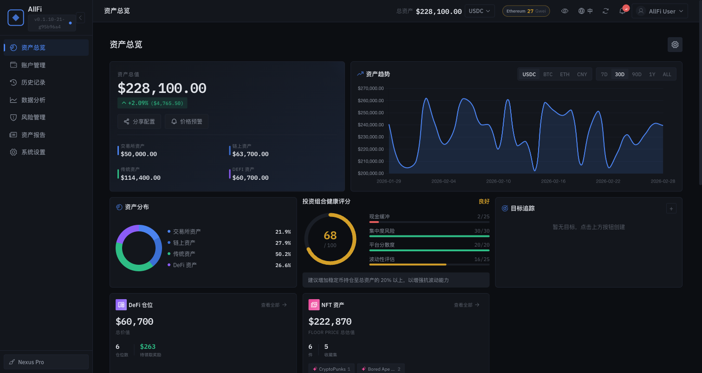

> 一屏聚合 CEX + 链上 + DeFi + 传统资产，实时显示总资产、今日盈亏、资产趋势图与分布饼图

### 核心页面

<table>
  <tr>
    <td width="50%">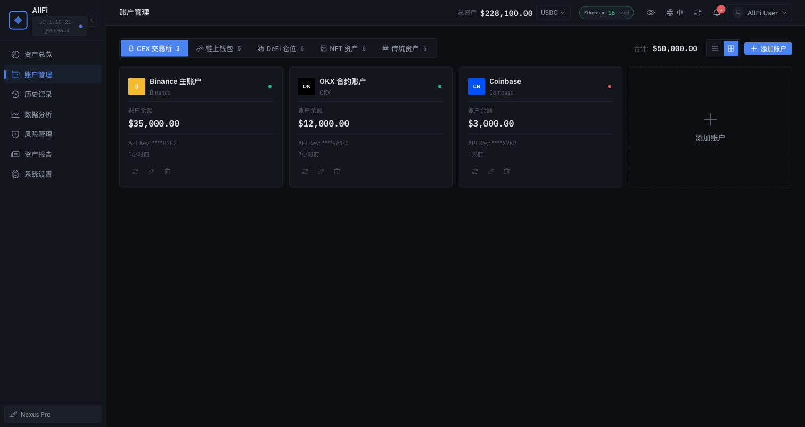<br><b>账户管理</b> — CEX / 链上钱包 / DeFi / NFT / 传统资产分标签管理</td>
    <td width="50%">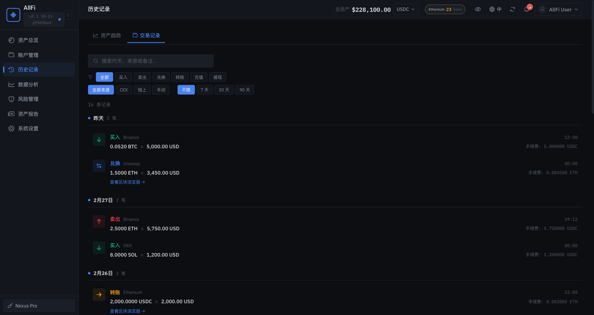<br><b>交易记录</b> — CEX + 链上交易统一聚合，支持筛选和搜索</td>
  </tr>
  <tr>
    <td>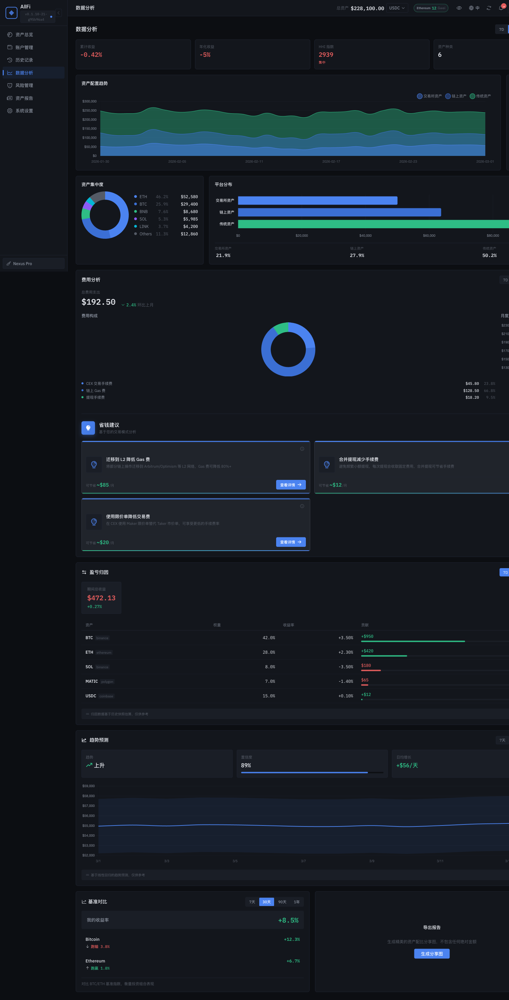<br><b>数据分析</b> — 每日盈亏、费用分析、归因分析、基准对比</td>
    <td>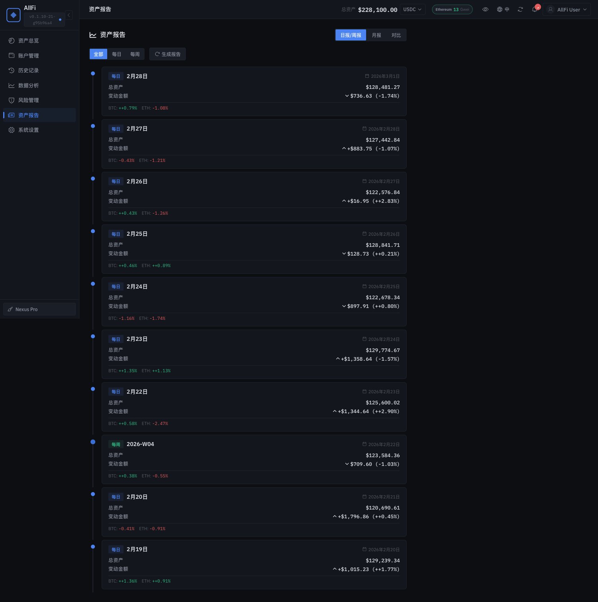<br><b>资产报告</b> — 日报 / 周报 / 月报 / 年报自动生成</td>
  </tr>
</table>

### 仪表盘细节

<table>
  <tr>
    <td width="33%"><br><b>投资组合健康评分</b> — 现金缓冲 / 集中度 / 平台分散度 / 波动性</td>
    <td width="33%">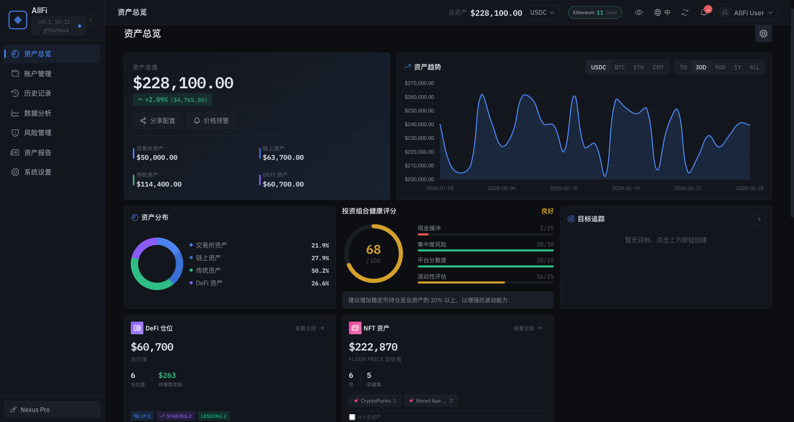<br><b>NFT 资产 + 费用分析</b> — 收藏估值、Gas 费追踪、省钱建议</td>
    <td width="33%">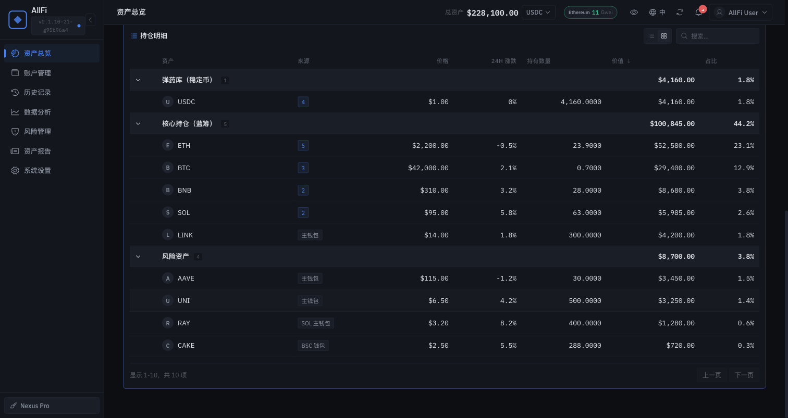<br><b>策略引擎 + 持仓明细</b> — 自动化策略、再平衡、智能分组</td>
  </tr>
</table>

### 4 套专业主题

<table>
  <tr>
    <td width="25%"><br><b>Nexus Pro</b><br>Bloomberg 风格，专业金融蓝</td>
    <td width="25%">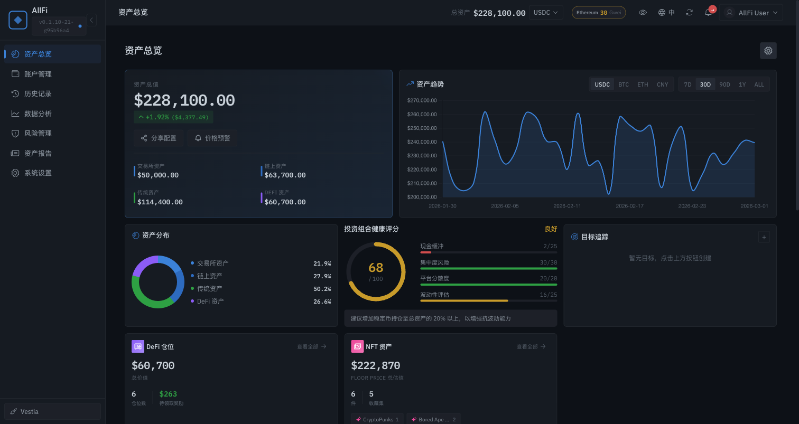<br><b>Vestia</b><br>GitHub 深色风格</td>
    <td width="25%">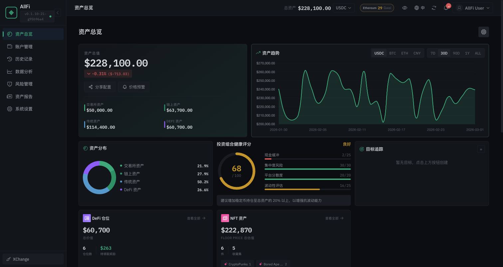<br><b>XChange</b><br>交易所风格，沉稳绿色</td>
    <td width="25%">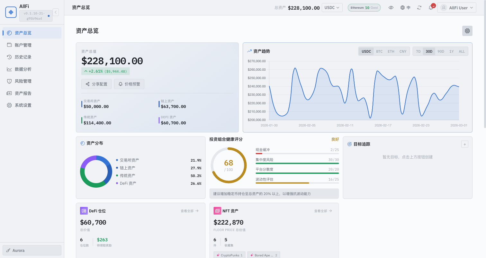<br><b>Aurora</b><br>专业浅色主题</td>
  </tr>
</table>

### 特色功能

<table>
  <tr>
    <td width="33%">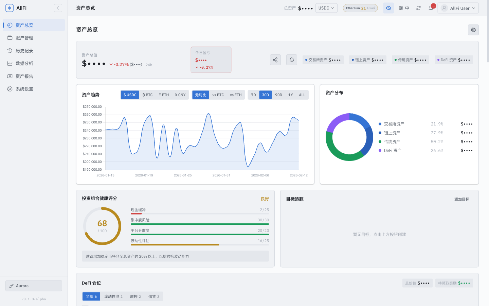<br><b>隐私模式</b> — Ctrl+H 一键隐藏金额（$••••），屏幕共享时保护隐私</td>
    <td width="33%">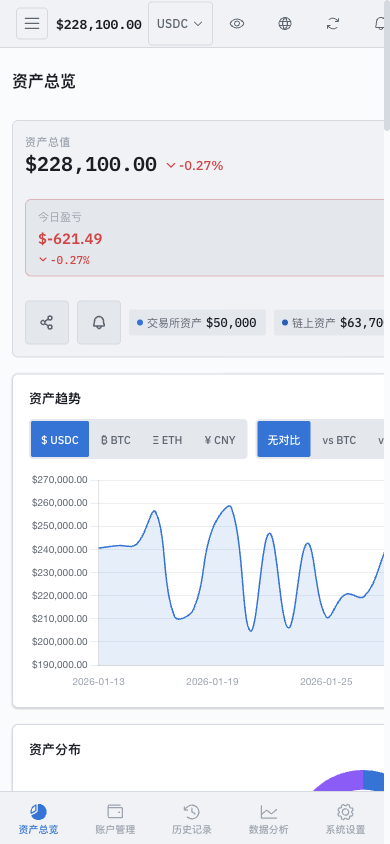<br><b>移动端适配</b> — 响应式布局 + 底部导航栏 + 下拉刷新</td>
    <td width="33%">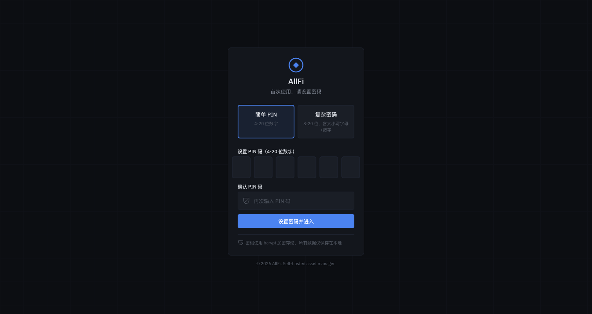<br><b>PIN 认证</b> — 简洁安全的 PIN 码登录，bcrypt 加密</td>
  </tr>
</table>

---

## 快速开始

### 方式一：Docker 部署（推荐） 🐳

**仅需 Docker，无需本地安装 Go / Node.js / pnpm。**

前置条件：Docker 20.10+, Docker Compose v2+

#### 一键脚本部署

```bash
# 克隆仓库并一键启动
git clone https://github.com/your-finance/allfi.git
cd allfi
bash deploy/docker-deploy.sh
```

脚本自动完成：自动检测 Docker 环境 → 生成 `.env` + 安全密钥 → 构建并启动全部服务。

#### 手动 Docker 部署

```bash
git clone https://github.com/your-finance/allfi.git
cd allfi

# 生成 .env（首次必须）
cp .env.example .env
# 编辑 .env，至少修改 ALLFI_MASTER_KEY（或用下一行自动生成）
sed -i "s|CHANGE_ME_USE_openssl_rand_base64_32|$(openssl rand -base64 32)|" .env

# 启动服务
docker compose up -d --build
```

#### 默认端口映射

| 服务 | 容器端口 | 主机端口 | 访问地址 |
|------|---------|---------|---------|
| 前端（Nginx） | 80 | **3174** | http://localhost:3174 |
| 后端（Go API） | 8080 | **8080** | http://localhost:8080 |

访问 [http://localhost:3174](http://localhost:3174) 即可使用。首次访问需设置 PIN 码（4-8 位数字）。

> **自定义端口**：编辑 `.env` 文件修改端口映射，然后重启服务：
> ```bash
> # .env
> FRONTEND_PORT=3000    # 前端改为 3000 端口
> SERVER_PORT=9090      # 后端改为 9090 端口
> ```
> ```bash
> docker compose up -d --build   # 修改后重启生效
> ```

```bash
# 常用 Docker 命令
docker compose logs -f       # 查看日志
docker compose down          # 停止服务
docker compose restart       # 重启服务
docker compose up -d --build # 重新构建并启动
```

### 方式二：本地开发

适合需要修改代码的开发者。依赖：Go 1.24+, Node.js 20+, pnpm。

```bash
git clone https://github.com/your-finance/allfi.git
cd allfi
make setup    # 自动生成 .env + 安装前后端依赖
make dev      # 同时启动前后端开发服务器
```

访问 [http://localhost:3174](http://localhost:3174) 即可使用。首次访问需设置 PIN 码（4-8 位数字）。

> **注意**：`make setup` 会自动检测本地环境。如果缺少 Go 或 pnpm，会跳过对应的依赖安装步骤并给出提示。

### 方式三：Mock 体验（无需后端）

只想快速看看 UI？不需要启动后端。依赖：Node.js 20+, pnpm。

```bash
cd allfi
cd webapp && pnpm install && pnpm dev:mock
```

访问 [http://localhost:3174](http://localhost:3174)，所有数据为模拟数据。

### 常用命令速查

```bash
make help           # 查看所有命令
make dev            # 启动前后端（需要 Go + pnpm）
make dev-mock       # 纯前端 Mock 模式（需要 pnpm）
make build          # 构建前后端
make docker         # Docker 启动
make health         # 健康检查
make swagger        # 打开 Swagger UI
```

> 详细部署说明见 [部署指南](./docs/guides/deployment-guide.md)。国内用户代理配置见 [代理指南](./docs/guides/proxy-guide.md)。

---

## 技术栈

| 层级 | 技术 |
|------|------|
| 后端 | Go 1.24 + GoFrame v2.10 + GoFrame ORM + SQLite3 |
| 前端 | Vue 3.5 + Vite 7.3 + Tailwind CSS 4 + Pinia 3 + Chart.js 4 + Phosphor Icons + VueUse |
| 认证 | PIN 码 bcrypt + JWT Bearer Token |
| 加密 | AES-256-GCM（API Key 加密存储） |
| 部署 | Docker Compose（只读容器 + 非特权 + healthcheck） |
| API 文档 | OpenAPI 3.0 + Swagger UI（`/api/v1/docs`） |

### 架构

```
前端 (Vue 3.5 / Vite 7.3 / Tailwind CSS 4)
    ↓ RESTful API
后端 (Go 1.24 / GoFrame v2.10)
    ├── api/              API 定义（RESTful 规范）
    ├── app/              业务模块（26 个模块）
    │   ├── controller/   控制器层
    │   ├── logic/        业务逻辑层
    │   └── service/      服务接口层
    └── integrations/     第三方集成（8 个模块）
    ↓
数据层 (GoFrame ORM + SQLite3, 26 个实体)
```

---

## 项目结构

```
allfi/
├── core/                       # 后端（Go + GoFrame v2.10）
│   ├── cmd/server/main.go      # 服务入口
│   ├── api/v1/                 # API 定义（RESTful 规范）
│   ├── internal/
│   │   ├── app/                # 业务模块（26 个）
│   │   │   └── {module}/
│   │   │       ├── controller/ # 控制器
│   │   │       ├── logic/      # 业务逻辑
│   │   │       └── service/    # 服务接口
│   │   ├── model/entity/       # 数据模型（26 个实体）
│   │   └── integrations/       # 第三方集成（8 个模块）
│   └── manifest/config/        # 配置文件
├── webapp/                     # 前端（Vue 3.5 + Tailwind CSS 4）
│   └── src/
│       ├── pages/              # 9 个页面
│       ├── components/         # 39 个组件
│       ├── stores/             # 13 个 Pinia Store
│       └── composables/        # 8 个组合式函数
└── docs/                       # 项目文档
    ├── product/                # 产品文档
    ├── tech/                   # 技术文档
    ├── specs/                  # 需求规格
    ├── design/                 # 设计文档
    └── guides/                 # 使用指南
```

---

## 文档

完整文档索引见 [docs/README.md](./docs/README.md)。

| 分类 | 文档 |
|------|------|
| 产品 | [业务概览](./docs/product/biz-overview.md) · [功能全景](./docs/product/feature-overview.md) |
| 技术 | [技术基线](./docs/tech/tech-baseline.md) · [API 文档](./docs/tech/api-reference.md) · [Swagger UI](http://localhost:8080/api/v1/docs) |
| 指南 | [部署指南](./docs/guides/deployment-guide.md) · [开发指南](./docs/guides/dev-guide.md) · [代理指南](./docs/guides/proxy-guide.md) · [用户指南](./docs/guides/user-guide.md) |
| 设计 | [UI/UX 规范](./docs/design/ui-ux-standards.md) · [多语言系统](./docs/design/i18n.md) |
| 规格 | [前端规格](./docs/specs/frontend-spec.md) · [后端规格](./docs/specs/backend-spec.md) |

---

## 安全说明

- API Key 使用 **AES-256-GCM** 加密存储，数据库中无明文
- PIN 码使用 **bcrypt** 哈希，不可逆
- 完全**自托管**，数据不离开你的服务器
- 建议 API Key 仅授予**只读权限**，禁止提现/交易权限
- Docker 容器以**非特权 + 只读**模式运行

---

## 贡献指南

1. Fork 本仓库
2. 创建功能分支（`git checkout -b feature/xxx`）
3. 编写测试（覆盖率 >70%）
4. 提交 Pull Request

---

## 许可证

[MIT License](LICENSE)

---

**构建于 2026 年，为 Web3 从业者打造**

- GitHub: https://github.com/your-finance/allfi
- Issues: https://github.com/your-finance/allfi/issues
