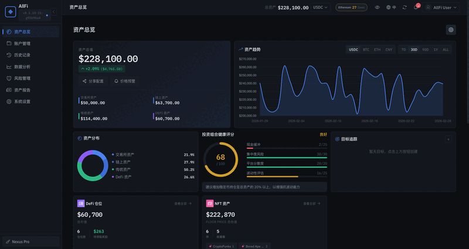
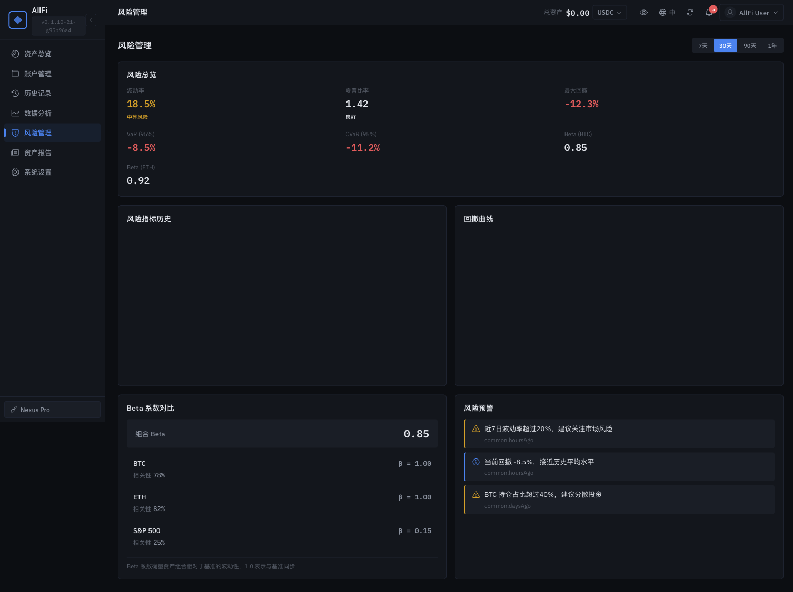
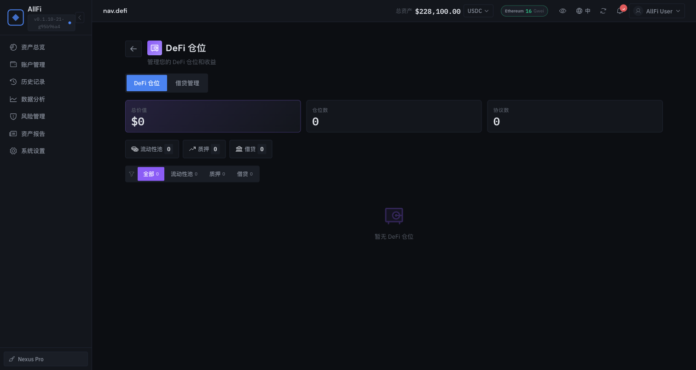

# AllFi — 全资产聚合平台

> 专为 Web3 从业者打造的个人私有化资产控制中心。

[](LICENSE)
[](https://golang.org/)
[](https://goframe.org/)
[](https://vuejs.org/)
[](https://vite.dev/)
[](https://tailwindcss.com/)

[English](./README.en.md)

---

## 为什么需要 AllFi？（解决什么痛点）

**“天天都在币本位新高，既兴奋又难受？”**
当比特币暴跌时，即便你的山寨币对 BTC 上涨，你的法币总资产可能依然在严重缩水。别再被单一计价的幻觉所困扰！

作为 Web3 从业者或深度参与者，你可能每天都在面临这些头疼的问题：

1. **资产极度分散**：钱散落在 Binance、OKX、几十个链上钱包以及各种 DeFi 协议（Lido、Aave...）里，还要兼顾现实中的银行存款和美股。想一眼看清“我到底有多少钱”成了一种奢望。
2. **计价体系混乱**：赚了币还是赚了 U？到底法币本位有没有赚钱？各个平台的计价方式都不一样，难以在牛熊切换中保持清醒。
3. **安全与隐私焦虑**：想要一站式管理，但**绝不敢**把交易所 API Key 和几十个钱包的地址轻易授权给中心化的 SaaS 记账工具，更怕被人盯上。
4. **手工记账如同坐牢**：用 Excel 维护资产表，每次都要自己查价格、算数量，坚持不了一个月就放弃了。

## AllFi 的解决方案

AllFi 为此而生。它不是一个 SaaS 服务，而是一个**完全开源、本地自托管**的个人全资产聚合平台。你的 API Key、钱包地址和资产数据永远只存在你自己的电脑或服务器上，甚至断网也能看。

一键自由切换多币种计价（USDC / BTC / ETH / CNY），穿透牛熊迷雾，看清真实的资产全局。

支持统一管理你的加密资产与传统资产：
- **CEX 交易所**：Binance、OKX、Coinbase
- **Web3 链上**：Ethereum、BSC、Polygon（+ Arbitrum/Optimism/Base）
- **DeFi 协议**：Lido、RocketPool、Aave、Compound、Uniswap V2/V3、Curve
- **NFT 资产**：Alchemy 集成，浏览和估值
- **传统资产**：银行存款、现金、股票、基金

### 🌟 秀出你的“收益率”

使用 AllFi，你可以一键开启**隐私模式（Ctrl+H）**，在完美隐藏具体金额数字（变成 `$••••`）的同时，保留你的资产分布饼图、趋势收益率和投资成就徽章。
**安全地向群友和社区分享你的仪表盘截图，秀出你的资产管理艺术吧！**

---

## 核心功能

| 分类 | 功能 |
|------|------|
| 资产聚合 | CEX + 链上 + DeFi + NFT + 传统资产，一屏总览 |
| 多币种计价 | USDC / BTC / ETH / CNY 自由切换 |
| 交易记录 | CEX + 链上统一聚合，增量同步，cursor 分页 |
| 数据分析 | 每日盈亏、费用分析、归因分析、基准对比（vs BTC/ETH/S&P500） |
| 资产报告 | 日报 / 周报 / 月报 / 年报自动生成 |
| 成就系统 | 11 项投资成就解锁 |
| 通知推送 | 价格预警 + WebPush 浏览器推送 |
| 隐私模式 | 一键隐藏金额，屏幕共享时保护隐私 |
| 多主题 | 4 套专业金融主题（3 深色 + 1 浅色） |
| 多语言 | 简体中文 / 繁体中文 / English |
| PWA | 可添加到手机主屏幕，离线可用 |
| 版本管理 | 统一版本号 + 在线更新检测 + 宿主机 OTA / Docker sidecar 更新 |

---

## 界面预览

### 演示动图



> 快速浏览 AllFi 的核心功能页面

### 资产总览（Nexus Pro 默认主题）


> 一屏聚合 CEX + 链上 + DeFi + 传统资产，实时显示总资产、今日盈亏、资产趋势图与分布饼图

### 核心页面

<table>
  <tr valign="top">
    <td width="50%">
      
      <br><b>账户管理</b> — CEX / 链上钱包 / DeFi / NFT / 传统资产分标签管理
    </td>
    <td width="50%">
      
      <br><b>资产报告</b> — 日报 / 周报 / 月报 / 年报自动生成
    </td>
  </tr>
  <tr valign="top">
    <td width="50%">
      
      <br><b>交易记录</b> — CEX + 链上交易统一聚合，支持筛选和搜索
    </td>
    <td width="50%">
      
      <br><b>数据分析</b> — 每日盈亏、费用分析、归因分析、基准对比
    </td>
  </tr>
  <tr valign="top">
    <td width="50%">
      
      <br><b>风险管理</b> — 波动率、夏普比率、最大回撤、VaR 等风险指标
    </td>
    <td width="50%">
      
      <br><b>DeFi 仓位</b> — Lido、Aave、Compound 等协议持仓一览
    </td>
  </tr>
</table>

### 仪表盘细节

<table>
  <tr valign="top">
    <td width="33%"><br><b>投资组合健康评分</b> — 现金缓冲 / 集中度 / 平台分散度 / 波动性</td>
    <td width="33%"><br><b>NFT 资产 + 费用分析</b> — 收藏估值、Gas 费追踪、省钱建议</td>
    <td width="33%"><br><b>持仓明细</b> — 自动化、智能分组</td>
  </tr>
</table>

### 4 套专业主题

<table>
  <tr valign="top">
    <td width="25%"><br><b>Nexus Pro</b><br>Bloomberg 风格，专业金融蓝</td>
    <td width="25%"><br><b>Vestia</b><br>GitHub 深色风格</td>
    <td width="25%"><br><b>XChange</b><br>交易所风格，沉稳绿色</td>
    <td width="25%"><br><b>Aurora</b><br>专业浅色主题</td>
  </tr>
</table>

### 特色功能

<table>
  <tr valign="top">
    <td width="50%">
      
      <br><b>隐私模式</b> — Ctrl+H 一键隐藏金额（$••••），屏幕共享时保护隐私
      <br><br>
      
      <br><b>灵活认证</b> — PIN 码或复杂密码可选，支持 2FA 双因素认证，bcrypt 加密
    </td>
    <td width="50%" align="center">
      
      <br><b>移动端适配</b> — 响应式布局 + 底部导航栏 + 下拉刷新
    </td>
  </tr>
</table>

---

## 快速开始

### 方式一：最终用户一键部署（推荐） 🐳

**只需要 Docker，不需要本地安装 Go / Node.js / pnpm。**

```bash
curl -sSL https://raw.githubusercontent.com/your-finance/allfi/master/deploy/docker-deploy.sh | bash
```

这个脚本会：

- 自动检测架构并下载最新 Release
- 生成独立部署目录 `allfi-docker/`
- 自动生成 `.env` 和随机密钥
- 构建最小化运行镜像并启动服务

默认访问地址：

- 页面与 API：`http://localhost:3000`
- Swagger：`http://localhost:3000/swagger/`

> 说明：脚本生成的是最小化部署目录，当前**不包含**仓库根目录里的 `updater` sidecar，因此不要把它理解成“页面内一键更新”部署形态。升级建议是重新执行脚本或重新部署新 Release。

### 方式二：宿主机二进制运行

适合不想用 Docker 的用户。

1. 打开 [GitHub Releases](https://github.com/your-finance/allfi/releases)
2. 下载对应平台压缩包
3. 解压后运行：

```bash
./allfi
```

默认访问地址：

- 页面与 API：`http://localhost:8080`
- Swagger：`http://localhost:8080/swagger/`

> 宿主机模式下，当前代码已经实现 OTA 二进制更新逻辑。

### 方式三：仓库内 Docker Compose（维护者）

根目录 `docker-compose.yml` 更适合维护者，不是“克隆后直接 `docker compose up -d`”的纯源码体验，因为它默认引用本地镜像 `allfi-backend:latest`。

推荐流程：

```bash
git clone https://github.com/your-finance/allfi.git
cd allfi
cp .env.example .env
docker build -f core/Dockerfile -t allfi-backend:latest .
docker compose up -d --build
```

默认访问地址：

- 页面与 API：`http://localhost:3000`
- 容器内服务端口：`8080`

### 方式四：本地开发

适合需要修改代码的开发者。依赖：Go 1.24、Node.js 20+、pnpm。

```bash
git clone https://github.com/your-finance/allfi.git
cd allfi
make setup
make dev
```

开发地址：

- 前端：`http://localhost:3000`
- 后端：`http://localhost:8080`
- Swagger：`http://localhost:8080/swagger/`

### 方式五：Mock 体验（无需后端）

```bash
cd webapp
pnpm install
pnpm dev:mock
```

访问 `http://localhost:3000` 即可体验模拟数据 UI。

### 常用命令

```bash
make help
make dev
make dev-mock
make build
make health
make swagger
```

更多细节见 [部署指南](./docs/guides/deployment-guide.md) 与 [开发指南](./docs/guides/dev-guide.md)。

---

## 当前项目状态

这是按 2026-03-31 仓库实际内容审计后的结果：

| 维度 | 当前状态 |
|------|---------|
| 前端页面 | 12 个 |
| 前端组件 | 58 个 |
| Pinia Store | 13 个 |
| 后端业务模块 | 29 个 |
| 定时任务 | 10 个 |
| API 定义 | 78 个 `g.Meta path` |
| Swagger | `/swagger/` |
| OpenAPI JSON | `/api.json` |

测试现状：

- `cd core && go test ./... -timeout 60s` 当前通过
- `cd webapp && pnpm test --run` 当前 27 个测试全部通过
- `exchange_rate/provider` 中依赖外网的集成测试已改为显式 opt-in，需要设置 `ALLFI_RUN_ONLINE_TESTS=1` 才会执行

完整说明见 [项目现状文档](./docs/project-status.md)。

---

## 技术栈

| 层级 | 技术 |
|------|------|
| 后端 | Go 1.24.11 + GoFrame v2.10 |
| 前端 | Vue 3.5 + Vite 7.3 + Pinia 3 + Chart.js 4 + Tailwind CSS 4 |
| 认证 | PIN / 复杂密码 + JWT + 2FA（TOTP） |
| 加密 | AES-256-GCM |
| 数据存储 | SQLite（默认） |
| API 文档 | OpenAPI 3.0 + Swagger UI（`/swagger/`） |

### 架构摘要

```text
浏览器 / PWA
    │
    ├── 开发模式：Vite dev server (:3000) -> API 代理到 :8080
    └── 发布模式：后端 embed 前端静态资源，单端口提供页面 + API

前端
    Vue 3 + Vite 7 + Pinia + Vue Router

后端
    GoFrame ghttp/gdb/gcfg/goai
    controller -> logic -> service -> dao/model

数据
    SQLite 默认配置
```

---

## 文档

完整索引见 [docs/README.md](./docs/README.md)。

| 分类 | 文档 |
|------|------|
| 总览 | [项目现状](./docs/project-status.md) · [文档索引](./docs/README.md) |
| 技术 | [技术基线](./docs/tech/tech-baseline.md) · [API 文档](./docs/tech/api-reference.md) |
| 指南 | [部署指南](./docs/guides/deployment-guide.md) · [开发指南](./docs/guides/dev-guide.md) · [代理指南](./docs/guides/proxy-guide.md) · [用户指南](./docs/guides/user-guide.md) |
| 设计 | [UI/UX 规范](./docs/design/ui-ux-standards.md) · [多语言系统](./docs/design/i18n.md) |
| 规格 | [前端规格](./docs/specs/frontend-spec.md) · [后端规格](./docs/specs/backend-spec.md) |

---

## 安全说明

- API Key 使用 **AES-256-GCM** 加密存储
- 密码使用 **bcrypt** 哈希，不可逆
- 支持 **PIN 模式**（4-20 位数字）与 **复杂密码模式**（8-20 位，含大小写字母和数字）
- 支持 **2FA / TOTP**
- 完全自托管，数据默认不离开你的机器或服务器
- 建议交易所 API Key 仅授予**只读权限**

---

## 贡献

1. Fork 本仓库
2. 创建功能分支
3. 如改动影响行为，请补测试或更新文档
4. 提交 Pull Request

---

## 许可证

[MIT License](LICENSE)

---

- GitHub: https://github.com/your-finance/allfi
- Issues: https://github.com/your-finance/allfi/issues
